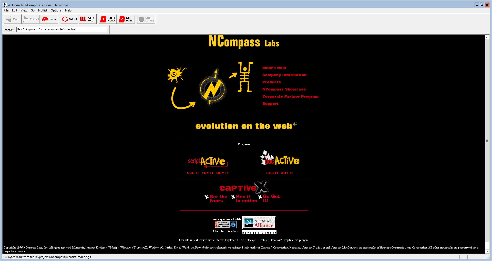
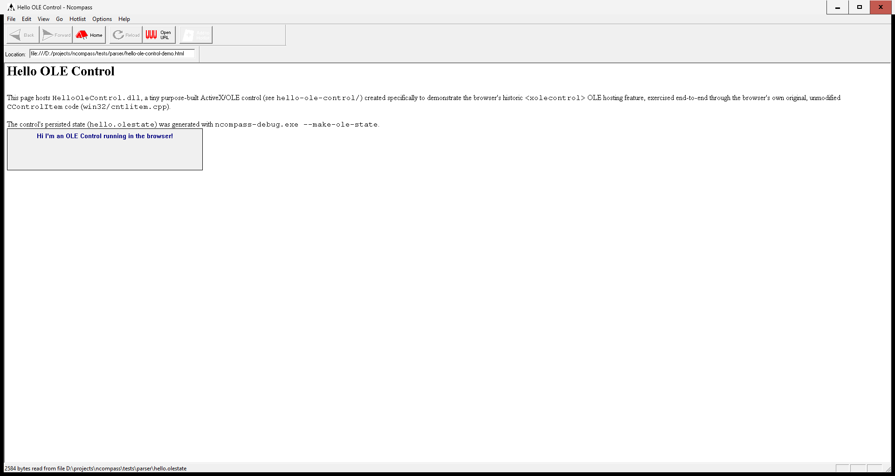

# Ncompass

> ⚠️ **Historical/educational software only — do not browse the live web
> with it.** This browser hosts arbitrary native OLE/ActiveX controls with
> no sandboxing, no modern TLS/certificate hardening, and none of the last
> ~30 years of browser security work. Treat it the same way you'd treat any
> other unpatched 1996 Windows binary: run it against local files or
> content you trust completely, not the public internet.

Ncompass is the circa-1996 web browser originally shipped by **NCompass Labs
Inc.**, a Vancouver company. It was the **first browser to host OLE
controls embedded directly in HTML pages** — the technology Microsoft would
soon rebrand and popularize as **ActiveX**. The idea was essentially
**"Visual Basic for the web"**: VB's whole appeal was assembling an
application out of pre-built VBX/OLE controls from a large existing
third-party ecosystem, and the browser was meant to become just another
container for those same controls — a web page as a VB form, dropping in
components that already existed rather than reinventing them in HTML. Once
ActiveX control hosting shipped natively in Internet Explorer, there was no
longer a reason for a whole standalone browser built around that one
feature: NCompass pivoted its technology into browser plug-ins instead —
**ScriptActive** and **DocActive**, which hosted ActiveX controls and Office
documents inside Netscape Navigator — and this browser, Ncompass, was
discontinued.

In hindsight, letting a web page instantiate and host an arbitrary native
COM object — full access to the OS, the filesystem, the registry, no
sandbox — is a fairly alarming idea; ActiveX's security record over the
following decade bore that out repeatedly. But in the bold, optimistic days
of 1995, before "drive-by download" was a phrase anyone needed, it looked
like exactly the right way to make the web programmable.

This repository restores the original MFC/Win32 C++ source so it builds and
runs reliably on modern 64-bit Windows with Visual Studio 2022, while
keeping the historical browser code itself as close to its original 1996
form as possible.



The screenshot above is the browser built from this repository rendering
[website/index.html](website/index.html) — a curated copy of NCompass Labs'
own real 1996 homepage.

Since no original CaptiveX controls (NCompass's own ActiveX control pack)
survive anywhere, this repository also includes a tiny modern reproduction,
[hello-ole-control/](hello-ole-control/) — a from-scratch OLE control built
just to demonstrate the browser's `<xolecontrol>` hosting feature working
end to end, unmodified, against a real registered COM object. See
[hello-ole-control/README](#hello-ole-control-demo) below.

## What's in this repository

- The **original historical browser source**, built with a fully modern
  toolchain (Visual Studio 2022, MSVC v143, MSBuild `.sln`/`.vcxproj`) rather
  than its original 1996 one (Microsoft Visual C++ 4.x's "Developer Studio,"
  which used `.mak`/`.dsp`/`.dsw` project files — "Visual Studio" as a brand
  didn't exist until 1997). Only the `.cpp`/`.h` source is historical; the
  project files, compiler, and IDE are all deliberately current, with only
  the source changes required to make the original code build and run
  correctly today: WinINet-based HTTP/1.1 and HTTPS transport, a handful of
  real crash/race fixes found by extensive automated testing, and
  standards-compliant `file:///` URL handling. See
  [Design philosophy](#design-philosophy) below for how deliberately narrow
  that scope was kept.
- A **modern, fully independent C++17 test harness** (`testing/`) that
  drives the real browser end-to-end: page loads, multi-page navigation,
  multi-site regression, crash dump collection with in-process stack
  walking, strict timeouts, and process/job containment — none of it linked
  into the browser itself.
- A **curated snapshot of the original NCompass Labs website**
  (`website/`), both as a piece of history and as a period-accurate local
  test fixture for the restored browser.

## Repository layout

```
win32/       Win32/MFC port: document/view, OLE integration, protocols,
             dialogs, toolbar/menu resources. (historical)
cross_p/     The original portable HTML renderer core — parser, layout/
             formatter, GIF/JPEG decoders, loader — first written for the
             Macintosh browser and carried over unchanged into the Win32
             port. (historical)
jpeg/        Bundled Independent JPEG Group (IJG) decoder sources used by
             the JPEG MIME object. (historical, third-party)
mac/         The original Macintosh browser this project was ported from.
             Not built.
website/     Curated copy of the real 1996 NCompass Labs homepage and its
             image assets — a small, self-contained, period-accurate page
             used to exercise and screenshot the restored browser.
hello-ole-control/
             A tiny modern ActiveX/OLE control (ATL) used to demonstrate
             the browser's <xolecontrol> hosting feature end to end; not
             part of the historical codebase. See "Hello OLE control demo"
             below.
testing/     Modern C++17 test harness and PowerShell scripts. Fully
             independent of the historical code; see BUILDING.md.
tests/       Fixtures and manifests used by the harness (parser test HTML,
             multi-site regression lists).
ncompass.sln / ncompass.vcxproj
             The historical browser's build. testing/ncompass-debug.vcxproj,
             testing/ncompass-parse.vcxproj, and hello-ole-control's own
             .vcxproj are the modern/demo tools' builds.
```

## Architecture

The browser keeps its original layered design, separating network
transport, parsing, layout, and display:

1. **`CDynamicLoad`** (`cross_p/dynload.cpp`) selects a protocol
   (`CProtocolFile`, `CProtocolHTTP`, `CProtocolSMTP`, or the internal
   `CProtocolUnknown` fallback) and marshals asynchronous load
   notifications between a protocol worker thread and the UI thread.
2. **`CMimeDynamicLoad`** (`cross_p/mimeload.cpp`) inspects the response's
   MIME type and dispatches its bytes to the matching MIME object:
   `CParseHTML`, `CGifPicture`, `CJpegPicture`, or a memory/disk cache
   object.
3. **`CParseHTML`** (`cross_p/readhtml.cpp`) is a streaming HTML parser: it
   consumes arbitrary, network-sized byte chunks and produces a plain-text
   buffer plus a typed `CTag` stream, entity-decoded and boundary-safe
   regardless of where a chunk happens to split a tag or entity.
4. **`CFormatHTML`** (`cross_p/fmthtml.cpp`) lays the tag stream out into
   positioned format items — text runs, links, images, headings, lists,
   tables, and embedded OLE controls.
5. **`CViewhtmlView`** (`win32/viewhvw.cpp`) paints the visible format items
   through GDI and hosts live OLE controls as real in-place child windows —
   the browser's historically significant feature (see below).
6. Image MIME objects (`CGifPicture`, `CJpegPicture`) decode incrementally
   as bytes arrive and notify the view to repaint just the affected region,
   supporting progressive/interlaced rendering during a live download.

### Thread model

The loader enforces a strict two-side contract, guarded by `CAccessLock` on
each shared object (`win32/inc/mutex.h`):

- The **UI thread** calls `StartLoading`, `AbortLoading`, `DoNotifies`,
  `CNotifyObject::OnNotify` overrides, `OnPreLoading`, and
  `CFormatHTML::Format`.
- A **protocol worker thread** calls `OnBeginLoading`, `OnLoading`,
  `OnEndLoading`, and the `CMimeObject::OnReadData`/`OnEndOfFile` overrides
  that do the real parsing/decoding work. Every load path — including an
  unrecognized URL scheme or a load cancelled before it ever started —
  always creates a genuine worker thread for this, with no special case.

In Debug builds, `ASSERT_UI_THREAD()`/`ASSERT_WORKER_THREAD()` record which
thread is which at startup and crash immediately, with a full dump, the
instant either side of that contract is violated — the same mechanism the
historical code already used for lock-state assertions.

## Design philosophy

The guiding rule for every change to `win32/`, `cross_p/`, and `jpeg/` was:
**make it build and run reliably on modern Windows, then stop.** Where a
genuine bug surfaced during testing (a crash, a race, a hang), it was fixed
precisely at its root cause. Where new capability was required — modern TLS,
standards-compliant URLs — it was added as narrowly as possible and, where
practical, isolated into its own file (see `win32/wininet.cpp`) rather than
expanding the historical files themselves. Nothing needed only for testing
was ever added to the browser: the test harness drives the real browser
through its own, real, original UI (the location bar, `Open Location`, and
so on) instead of adding hooks for automation's sake.

The result is that the historical browser's diff against the originally
imported source stays as small and legible as the actual requirements
allow — it should always be possible to tell, file by file, exactly why a
change to the 1996 code was necessary.

## Building and testing

See [BUILDING.md](BUILDING.md) for full instructions, including:

- Toolchain requirements and build commands.
- `testing/ncompass-debug.exe` — the single native test tool: automatic
  crash dump collection with in-process stack walking, multi-site
  regression, multi-page navigation testing, isolated HTTP fetches
  (`--fetch`), and generic job/process containment (`--wrap`).
- `testing/ncompass-parse.exe` — a headless helper that compiles the
  browser's real parser directly, for chunk-boundary and concurrency
  testing without any UI.
- The PowerShell regression scripts under `testing/`.

## Hello OLE control demo



[hello-ole-control/](hello-ole-control/) is a minimal ActiveX/OLE control
(an in-process COM DLL, built with ATL) whose only job is to paint "Hi I'm
an OLE Control running in the browser!" It exists to prove out the
browser's `<xolecontrol>` hosting feature (`win32/cntlitem.cpp`) against a
real, registered COM object, without depending on any long-vanished
CaptiveX control or fighting version/bitness mismatches against today's
built-in Windows OCXes.

The control is loaded through the browser's original, unmodified
persisted-storage path — the same `CControlItem::OpenStorage` /
`CreateItemFromStorage` code a real CaptiveX control would have used in
1996 — via `<xolecontrol clsid="..." src="hello.olestate">`
(`tests/parser/hello-ole-control-demo.html`). The `.olestate` file is a
real OLE compound-file, generated with
`ncompass-debug.exe --make-ole-state`.

To build and try it yourself:

1. Build the `HelloOleControl` project (part of `ncompass.sln`); it lands
   next to the browser as `Debug\HelloOleControl.dll`.
2. Register it — no admin rights required, since it self-registers under
   `HKEY_CURRENT_USER`:
   ```
   regsvr32 Debug\HelloOleControl.dll
   ```
   (use the 32-bit `regsvr32` at `%WINDIR%\SysWOW64\regsvr32.exe`, since
   both the control and the browser are 32-bit.)
3. Generate the persisted state and open the demo page:
   ```
   ncompass-debug.exe --make-ole-state {3F2600F1-CF01-4618-BAC4-9A8AC30B8402} tests\parser\hello.olestate
   ncompass.exe tests\parser\hello-ole-control-demo.html
   ```

## Original authors

The original 1996 Ncompass browser was built by **Kristof Roomp**, along
with **Kerem Karatal**, who worked on the OLE container. Its HTML renderer
(`cross_p/`) began life in an earlier Macintosh browser and was then ported
to Win32, which is why the portable core and the Win32-specific UI/OLE code
still live in separate directories today.

## Acknowledgments

Reviving this 1996 codebase on a modern OS — diagnosing and fixing the
crashes, races, and hangs that kept it from running at all — was done with
the help of an AI assistant (Copilot SDK, in VS Code).

## License

MIT — see [LICENSE](LICENSE).
